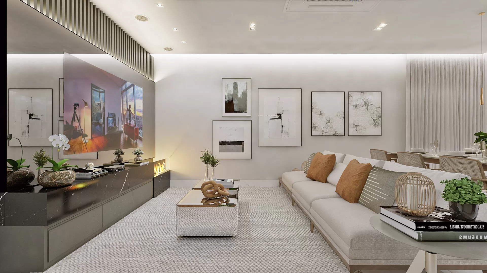

# Antunes Interiores - Landing Page


> Uma Landing Page de alta conversão desenvolvida para um escritório de Design de Interiores.

## Sobre o Projeto

Este projeto consiste em uma página única totalmente responsiva. O objetivo foi criar uma interface elegante que transmitisse a identidade da marca "Antunes Interiores".

---

##  Funcionalidades Principais

Aqui estão os destaques técnicos e visuais implementados no projeto:

###  Interface & Design (UI)
- **Design Responsivo (Mobile-First):** Layout adaptável que funciona perfeitamente em celulares, tablets e desktops grandes.
- **Hero Section Imersiva:** Imagem de alta qualidade com sobreposição escura e tipografia hierarquizada para impacto visual imediato.
- **Tipografia Premium:** Combinação das fontes *Cormorant Garamond* (Serifa para títulos) e *Montserrat* (Sans-serif para leitura), transmitindo luxo e modernidade.

###  Experiência do Usuário (UX)
- **Smooth Scroll (Rolagem Suave):** Navegação fluida entre as seções ao clicar no menu, com compensação de altura para o cabeçalho fixo.
- **Microinterações:**
  - Efeito de **Zoom Lento (Ken Burns)** nos cards de projetos.
  - Efeito de **Slide Up** nos textos ao passar o mouse.
  - Botões e Links com transições suaves de cor e preenchimento.
- **Menu Mobile Animado:** Menu lateral (Drawer) que desliza suavemente com efeito de *backdrop* e bloqueio de rolagem do fundo.

###  Formulário Inteligente & Contato
- **Máscara de Input em Tempo Real:** O campo de WhatsApp formata automaticamente o número enquanto o usuário digita: `(11) 9XXXX-XXXX`.
- **Validação de Dados:**
  - Impede o envio de campos vazios.
  - Verifica se o formato do e-mail é válido (Regex).
  - Feedback visual imediato com bordas vermelhas em caso de erro.
- **Modal de Sucesso (Feedback):** Substituição do `alert()` padrão por um Popup (Modal) elegante e animado que confirma o envio dos dados.

---

##  Tecnologias Utilizadas

- **HTML5 Semântico:** Estrutura acessível e organizada.
- **Tailwind CSS:** Framework utilitário para estilização rápida, responsividade e animações.
- **JavaScript (Vanilla):** Lógica de validação, máscaras, menu mobile e manipulação do DOM sem dependência de bibliotecas pesadas.
- **FontAwesome:** Ícones vetoriais.
- **Google Fonts:** Importação de fontes otimizada.

---

##  Estrutura de Pastas

```bash
/
├── src/
│   ├── css/
│   │   ├── input.css      # Entrada do Tailwind
│   │   └── styles.css     # CSS Final Compilado
│   ├── img/               # Imagens otimizadas (WebP/PNG)
│   ├── js/
│   │   └── scripts.js     # Lógica do Menu, Form e Modal
│   └── index.html         # Arquivo Principal
├── README.md              # Documentação
└── tailwind.config.js     # Configuração do Tailwind
